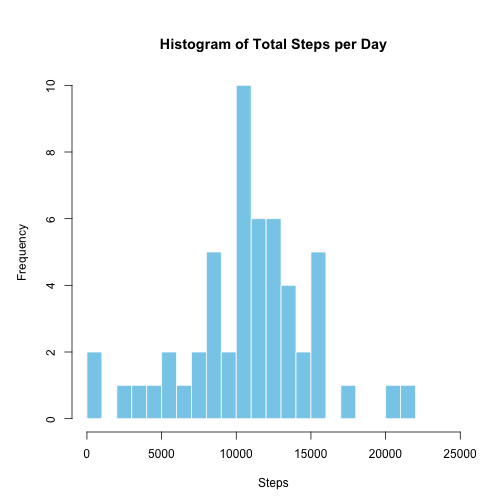
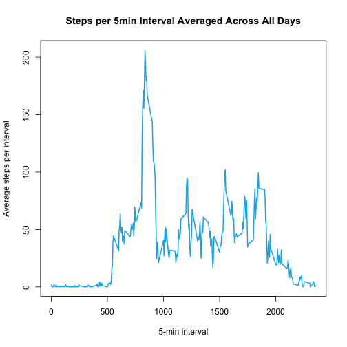
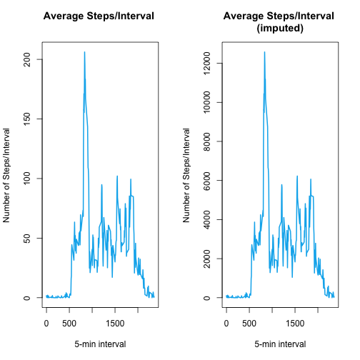
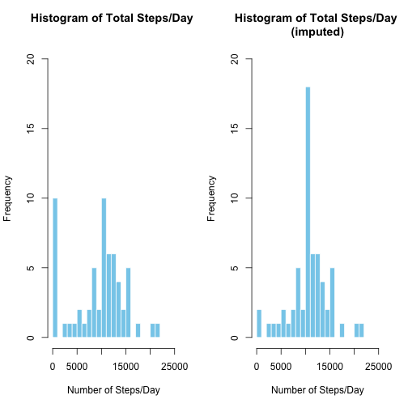
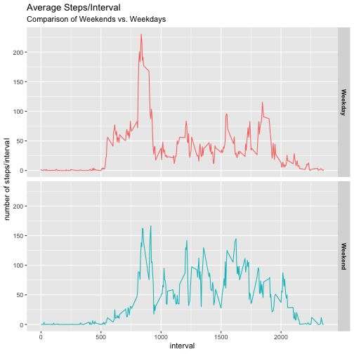

________________________________ 
## Overview  

#### *Assignment:*

*It is now possible to collect a large amount of data about personal movement using activity monitoring devices such as a Fitbit, Nike Fuelband, or Jawbone Up. These type of devices are part of the “quantified self” movement – a group of enthusiasts who take measurements about themselves regularly to improve their health, to find patterns in their behavior, or because they are tech geeks. But these data remain under-utilized both because the raw data are hard to obtain and there is a lack of statistical methods and software for processing and interpreting the data.*

*This assignment makes use of data from a personal activity monitoring device. This device collects data at 5 minute intervals through out the day. The data consists of two months of data from an anonymous individual collected during the months of October and November, 2012 and include the number of steps taken in 5 minute intervals each day.*
  
  
The raw dataset for this assignment 

* Was downloaded from [Activity monitoring data ](https://d396qusza40orc.cloudfront.net/repdata%2Fdata%2Factivity.zip)
* The file was 57KB compressed (.zip) and 351KB uncompressed (.csv)
* There are a total of 17,568 observations contained the dataset
* The variables included in this dataset are:
    1. **steps**: Number of steps taking in a 5-minute interval (missing values are coded as "NA")
    1. **date**: The date on which the measurement was taken in YYYY-MM-DD format
    1. **interval**: Identifier for the 5-minute interval in which measurement was taken

________________________________ 
## Loading and preprocessing the data  

#### *Assignment:*  

*Show any code that is needed to*  

1. *Load the data (i.e. - read.csv() ) *  
1. *Process/transform the data (if necessary) into a format suitable for your analysis*  
  
  
First load required libraries:

```r
## Load  libraries
library(ggplot2)
library(dplyr)
```
  
We load the raw dataset (.csv) into a dataframe ('activity') using read.csv()


```r
## read raw dats (.csv file) into dataframe ('activity')
activity <- read.csv("./data/activity.csv",
                     header=TRUE, 
                     colClasses=c(
                             "numeric",   ## steps: number of steps taken during 5min sub-interval of a day
                             "character", ## date: the specific day of sample 'steps'
                             "numeric"    ## interval: the specific 5min sub-interval of sample 'steps'
                     )
)
```

and convert variables (date, interval) to factors for later manipulation/reshaping.  


```r
## convert string ("YYYY-MM-DD") to class 'date' and then to 'factor'
activity$date <- as.factor(as.Date(activity$date, format="%Y-%m-%d"))
## convert interval to class 'factor'
activity$interval <- as.factor(activity$interval)
str(activity)
```

```
## 'data.frame':	17568 obs. of  3 variables:
##  $ steps   : num  NA NA NA NA NA NA NA NA NA NA ...
##  $ date    : Factor w/ 61 levels "2012-10-01","2012-10-02",..: 1 1 1 1 1 1 1 1 1 1 ...
##  $ interval: Factor w/ 288 levels "0","5","10","15",..: 1 2 3 4 5 6 7 8 9 10 ...
```

________________________________ 
## What is mean total number of steps taken per day?  

#### *Assignment:*  

*For this part of the assignment, you can ignore the missing values in the dataset.*  

1. *Calculate the total number of steps taken per day*  
1. *Make a histogram of the total number of steps taken each day. If you do not   understand the difference between a histogram and a barplot, research the difference   between them.*  
1. *Calculate and report the mean and median of the total number of steps taken per day* 
  
By grouping the dataset by date and  summing, we get steps/day over the sample period 10/1/12-11/30/12: 


```r
## group intervals by date and  sum over days 
stepsPerDay <- activity %>%
        group_by(date) %>%
        summarise(steps = sum(steps, na.rm = TRUE))
```

We can then create a histogram of daily totals and where you can see the most frequent steps per day is between 10,000 and 11,000: 


```r
## histogram of  total steps/day.
par(mfrow=c(1,1))
histInfo <- hist(stepsPerDay$steps, 
                 xlim=c(0,25000), breaks = 25,
                 col = "sky blue", border = "white",
                 main="Histogram of Total Steps per Day",
                 xlab="Steps", ylab="Frequency")
```



```r
histInfo[c("mids", "counts")]
```

```
## $mids
##  [1]   500  1500  2500  3500  4500  5500  6500  7500  8500  9500 10500
## [12] 11500 12500 13500 14500 15500 16500 17500 18500 19500 20500 21500
## 
## $counts
##  [1] 10  0  1  1  1  2  1  2  5  2 10  6  6  4  2  5  0  1  0  0  1  1
```


```r
## calculate mean & median
meanStepsPerDay <- format(round(mean(stepsPerDay$steps), 1), 
                          scientific=FALSE, nsmall=1, big.mark=",")
medianStepsPerDay <- format(round(median(stepsPerDay$steps), 1), 
                            scientific=FALSE, nsmall=1, big.mark=",")
```
We also calculate  **mean steps/day: 9,354.2**  
and **median steps/day: 10,395.0**.

________________________________ 
## What is the average daily activity pattern?  

#### *Assignment:*  

1. *Make a time series plot (i.e. - type="l") of the 5-minute interval (x-axis) and the average number of steps taken, averaged across all days (y-axis)*  
1. *Which 5-minute interval, on average across all the days in the dataset, contains the maximum number of steps?*  

Grouping the dataset by interval and calculating the mean, we arrive at average steps/interval across all of the days in the sample period.


```r
averageSteps <- activity %>%
        group_by(interval) %>%
        summarise(steps = mean(steps,na.rm = TRUE))
maxAverageSteps <- averageSteps[which.max(averageSteps$steps), ]
```

Which we then plot:

```r
par(mfrow=c(1,1))
plot(as.numeric(as.character(averageSteps$interval)), averageSteps$steps, 
     type = "l", 
     lwd = 2, col = "deep sky blue 2",
     main = "Steps per 5min Interval Averaged Across All Days",
     xlab = "5-min interval", ylab = "Average steps per interval" )
```



We also find the highest average number of steps occurred at **interval 835** with **206 steps**.

________________________________ 
## Imputing missing values  

#### *Assignment:*  

*Note that there are a number of days/intervals where there are missing values (coded as NA). The presence of missing days may introduce bias into some calculations or summaries of the data.*  

1. *Calculate and report the total number of missing values in the dataset (i.e. the total number of rows with NAs)*
1. *Devise a strategy for filling in all of the missing values in the dataset. The strategy does not need to be sophisticated. For example, you could use the mean/median for that day, or the mean for that 5-minute interval, etc.*
1. *Create a new dataset that is equal to the original dataset but with the missing data filled in.*
1. *Make a histogram of the total number of steps taken each day and Calculate and report the mean and median total number of steps taken per day.*  
 - *Do these values differ from the estimates from the first part of the assignment?*  
  - *What is the impact of imputing missing data on the estimates of the total daily number of steps?*  

We can also sum up all of the intervals in the dataset where steps is NA:


```r
missingValues <- sum(is.na(activity$steps))
```

and we find there are **2304 missing values**. 
  
Looking at the dataset, we noticed the NAs were all grouped in terms of entire days and opted to **correct for missing days by imputing each NA interval with its respective average** (over the sample period).

We do this by creating a new dataframe ('actvityImputed') and using mutate() and ifelse() to replace interval NAs with the respective averages calculated above ('averageSteps'):

```r
activityImputed <- activity
activityImputed <- activityImputed %>%
        mutate(steps = ifelse(is.na(steps), averageSteps[interval, ]$steps, steps))
```

We now repeat the total steps/day and average steps/interval calculations with the imputed dataset:

```r
## Calculate steps per day (imputed NA)
stepsPerDayImputed <- activityImputed %>%
        group_by(date) %>%
        summarise(steps = sum(steps,na.rm = TRUE))
averageStepsImputed <- activityImputed %>%
        group_by(interval) %>%
        summarise(steps = sum(steps,na.rm = TRUE))
```

________________________________ 
## Make a histogram of the total number of steps taken each day. If you do not understand the difference between a histogram and a barplot, research the difference between them.*

For comparison, we  plot side-by-side the average steps/interval for the unimputed and the imputed datasets:

```r
par(mfrow=c(1,2))
plot(as.numeric(as.character(averageSteps$interval)), averageSteps$steps, 
     type = "l", 
     lwd = 2, col = "deep sky blue 2",
     main = "Average Steps/Interval \n",
     xlab = "5-min interval", ylab = "Number of Steps/Interval" )
plot(as.numeric(as.character(averageStepsImputed$interval)), averageStepsImputed$steps, 
     type = "l", 
     lwd = 2, col = "deep sky blue 2",
     main = "Average Steps/Interval \n(imputed)",
     xlab = "5-min interval", ylab = "Number of Steps/Interval" )
```



and similarly, histograms of steps/day unimputed and imputed:

```r
par(mfrow=c(1,2))
hist(stepsPerDay$steps, 
     xlim=c(0,25000), breaks = 25,
     ylim=c(0,20),
     col = "sky blue", border = "white",
     main="Histogram of Total Steps/Day \n",
     xlab="Number of Steps/Day", ylab="Frequency")
hist(stepsPerDayImputed$steps, 
     xlim=c(0,25000), breaks = 25,
     ylim=c(0,20),
     col = "sky blue", border = "white",
     main="Histogram of Total Steps/Day \n(imputed)",
     xlab="Number of Steps/Day", ylab="Frequency")
```




```r
meanStepsPerDayImputed <- format(round(mean(stepsPerDayImputed$steps), 1), 
                                 scientific=FALSE, nsmall=1, big.mark=",")
medianStepsPerDayImputed <- format(round(median(stepsPerDayImputed$steps), 1), 
                                   scientific=FALSE, nsmall=1, big.mark=",")
```

We find that  imputing missing intervals with their corresponding averages has a small impact on the mean & median values:  

* mean: 10,766.2 average steps/day  vs. 9,354.2 unimputed  
* median: 10,766.2 average steps/day vs. 10,395.0unimputed       
We attribute this to the fact that by replacing the missing days (8 of 61) with average ones is primarily strengthening the mean of the resulting dataset.  

You can better see the effect in the histograms where the 8 missing days in the 0 bin move to the 10k (average) bin when imputed.

________________________________ 
## Are there differences in activity patterns between weekdays and weekends?  
  
#### *Assignment:*  

*For this part the weekdays() function may be of some help here. Use the dataset with the filled-in missing values for this part.*

1. *Create a new factor variable in the dataset with two levels – “weekday” and “weekend” indicating whether a given date is a weekday or weekend day.*
1. *Make a panel plot containing a time series plot (i.e. - type="l") of the 5-minute interval (x-axis) and the average number of steps taken, averaged across all weekday days or weekend days (y-axis). See the README file in the GitHub repository to see an example of what this plot should look like using simulated data.*

With the hint to consider the weekday() function, it was pretty straightfoward to add a 2-level factor ("Weekend", "Weekday") which we implemented with a simple:  **IF** (saturday|sunday) **THEN** weekend **ELSE** weekday  
    

```r
activityImputed2 <- activityImputed
activityImputed2$weekDayEnd <- ifelse(weekdays(as.Date(activityImputed2$date)) %in% c("Saturday", "Sunday"),"Weekend", "Weekday" )
activityImputed2$weekDayEnd <- as.factor(activityImputed2$weekDayEnd)
```

And grouping the data once again by interval

```r
activityImputed2 <- activityImputed2 %>%
        group_by(weekDayEnd, interval) %>%
        summarise(steps = mean(steps,na.rm = TRUE))
```

we can then compare weekdays vs. weekend activity using ggplot:

```r
pl <- ggplot(filter(activityImputed2, weekDayEnd %in% c("Weekend", "Weekday")),
             aes(x=as.numeric(as.character(interval)), y=steps, color=weekDayEnd) ) +
        geom_line() +
        facet_grid(weekDayEnd ~ ., scales="fixed", space="fixed") +
        labs(x="interval", 
             y="number of steps/interval",
             color= "Part of Week",
             title="Average Steps/Interval",
             subtitle="Comparison of Weekends vs. Weekdays"
             ) +
        theme(
                legend.position = "none",
                ## plot.margin = unit(c(1.5,1,1.5,1), "cm"),
                strip.text.y = element_text(face="bold")
                )
print(pl)
```



From the plots we observed the following:  

* on the weekend start-of-day activity is much lower and ramps more gradually  
    + ...and the morning peak (around 800) is lower *(our guess: no commute)*  
* on the weekend mid-day activity is significantly higher (roughly twice as high compared to weekdays)  
* on the weekend there is a gradual rolloff at end-of-day  
    + ...with no peak (around 1800) *(our guess: no commute)*  

